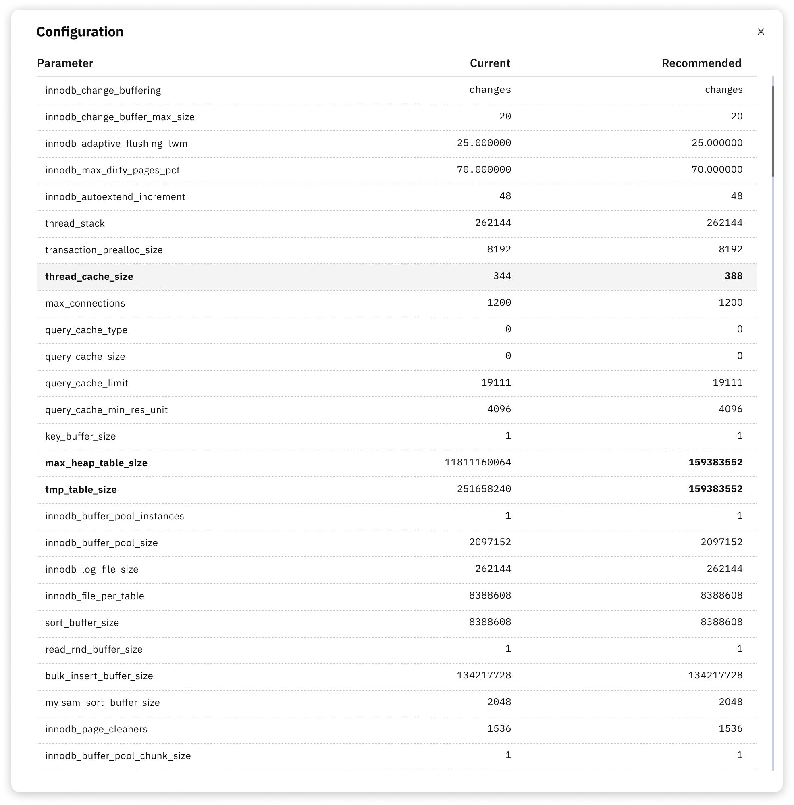

# Example of Recommended Configuration

This page provides an example of a recommended MySQL configuration as suggested by the Releem platform. The configuration settings listed here are designed to optimize the performance of your MySQL server by adjusting various parameters.




```
[mysqld]
query_cache_type = 1 ### Previous value : ON
query_cache_size = 128M ### Previous value : 134217728
query_cache_limit = 16M ### Previous value : 16777216
thread_cache_size = 8 ### Previous value : 8
key_buffer_size = 205520896 ### Previous value : 205520896
max_allowed_packet = 1073741824 ### Previous value : 67108864
sort_buffer_size = 16777216 ### Previous value : 25165824
read_rnd_buffer_size = 4194304 ### Previous value : 4194304
bulk_insert_buffer_size = 8M ### Previous value : 2097152
myisam_sort_buffer_size = 8388608 ### Previous value : 25165824
innodb_buffer_pool_instances = 2 ### Previous value : 3
innodb_buffer_pool_size = 3019898880 ### Previous value : 3019898880
max_heap_table_size = 256M ### Previous value : 268435456
tmp_table_size = 256M ### Previous value : 268435456
join_buffer_size = 8M ### Previous value : 8388608
max_connections = 151 ### Previous value : 151
table_open_cache = 3072 ### Previous value : 3072
table_definition_cache = 1920 ### Previous value : 1920
innodb_flush_log_at_trx_commit = 2 ### Previous value : 2
innodb_log_file_size = 377487360 ### Previous value : 805306368
innodb_write_io_threads = 4 ### Previous value : 4
innodb_read_io_threads = 4 ### Previous value : 4
innodb_file_per_table = 1 ### Previous value : ON
innodb_flush_method = O_DIRECT ### Previous value :
innodb_thread_concurrency = 0 ### Previous value : 0
```


