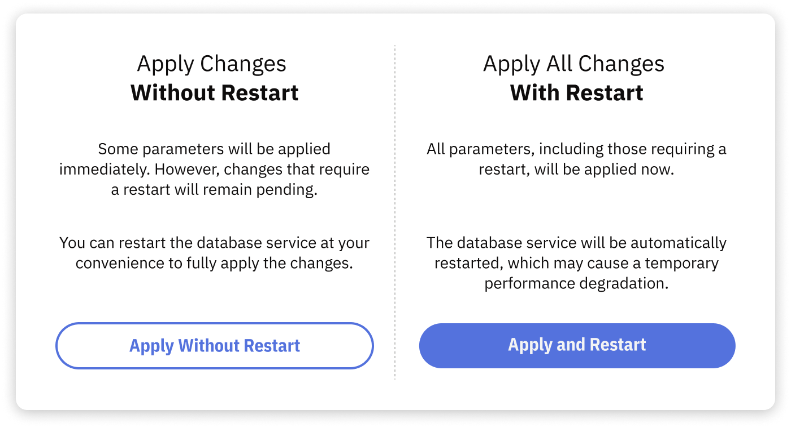

# How to Apply Configuration Using Portal

To apply the recommended configuration using the Releem Portal, follow these steps:

1. **Access the Releem Dashboard**: Log in to your Releem account and navigate to the Dashboard.

2. **Locate the Configuration Section**: In the Dashboard, find the section dedicated to configuration management.

3. **Review Recommended Configuration**: Examine the recommended configuration settings provided by Releem.

4. **Apply Configuration**:
   - **Without Restart**: If you wish to apply the configuration without restarting the database server, click the "Apply" button followed by "Apply Without Restart". This option is suitable for changes that do not require a server restart.
   - **With Restart**: For changes that necessitate a server restart, click the "Apply" button and then "Apply and Restart". This will apply all configuration changes and restart the database server to ensure all settings take effect.



By following these steps, you can efficiently apply and manage your database configuration using the Releem Portal.

## Troubleshooting applying configuration

### **FOR SELF-MANAGED SERVERS**

#### 1. The latest recommended configuration is partially applied
Certain MySQL variables require a server restart to be applied.
**User Action**: Click "Apply" followed by "Apply and Restart" in the Dashboard to apply all the recommended parameters and restart the database service.

#### 2. MySQL 'releem' user lacks required permissions to apply without restarting
This issue occurs if there are not enough permissions to apply without restarting.
User Action: To grant these privileges, run the following query in the MySQL console, depending on your version:
MariaDB and MySQL < 8:
```
select Concat("GRANT SUPER on *.* to `",User,"`@`", Host,"`;") from mysql.user where User='releem';
```

MySQL >= 8:
```
select Concat("GRANT SYSTEM_VARIABLES_ADMIN on *.* to `",User,"`@`", Host,"`;") from mysql.user where User='releem';
```

After executing the generated queries, restart the agent by running the commands on the server:
```
/opt/releem/releem-agent stop ; /opt/releem/releem-agent start
```

#### 3. Recommended MySQL Configuration Not Found
This issue arises if the process of applying recommendations is initiated before the Releem platform has completed generating these
User Action: Wait for approximately 12 hours to allow Releem to generate recommendations, or force the process by running:
```
/opt/releem/releem-agent -f
```

#### 4. MySQL Version Lower Than 5.6.7
Releem's automated features may not fully support MySQL versions lower than 5.6.7, especially if file replacement is required for an update.
User Action: [Manual applying of MySQL configuration](https://releem.com/docs/getstarted#rec491011156) is recommended in this case.

#### 5. MySQL Configuration Directory Not Found
This occurs when the installation of the Releem Agent is incorrect, or if the MySQL configuration directory has been deleted by the user.
User Action: The most straightforward solution is to reinstall the Releem Agent to ensure it's set up correctly.

#### 6. Command to Restart MySQL Service Not Found
This typically indicates an incorrect installation, often seen in Docker environments, where the command to restart MySQL services isn't found or accessible by the Releem Agent.
User Action: Reinstalling the agent is usually necessary to correct this issue. Also, please check mysql_restart_service setting in the /opt/releem/releem.conf

#### 7. No Confirmation to Restart Service Received
This can occur in scenarios where the database is too large, leading to delays, or in the event of a crash.
User Action: If the database is large, allow some time for it to restart automatically. If a crash is suspected, check the error logs for more details.

#### 8. MySQL Service Failed to Start in 1200 Seconds
Indicates that the MySQL service did not restart within the expected timeframe, which can happen with large databases or due to a crash.
User Action: Wait for the service to restart if you have a large database. In the case of a crash, consult the error logs.

#### 9. MySQL Service Failed to Start
This is a more general indication of a crash or failure in starting the MySQL service.
User Action: The primary recourse here is to check the MySQL error logs to diagnose the reason for the failure.

#### 10. Failed to finish applying the configuration
Agent stopped unexpectedly during applying configuration and unable to send information about task to Releem Platform.
User Action: send us please the output of the command "journalctl -u releem-agent" to hello@releem.com

#### 11. Unexpected Releem Agent error
Releem Platform received unexpected error from Releem Agent.
User Action: Please check that /opt/releem/mysqlconfigurer.sh is not empty and it has permissions to execute.
Send us please the output of the command "journalctl -u releem-agent" to hello@releem.com

### **FOR AWS RDS INSTANCES**

#### 1. RDS database instance has a status of not available
Check the status of the database instance in the aws console https://console.aws.amazon.com/rds/. Correct errors or wait until the instance status changes to available and reapply the configuration.

#### 2. DB instance parameter group has a status of not in-sync
Check the status of the DB instance parameter group in the aws console https://console.aws.amazon.com/rds/, under the Configuration tab on the DB instance information page. Correct errors or reload the DB instance to change the status to in-sync and reapply the configuration.

#### 3. DB instance parameter group is not specified in the agent settings, or is not found in the database configuration
In the aws console, create Parameter groups for your version of the db instance named “releem-agent”. Perform DB parameter group change for your db instance, reboot it if necessary.
Then update CloudFormation stack “releem-agent” with the new template https://releem.s3.amazonaws.com/test/releem-agent-cloudformation.yml and in the DBParametrGroup field specify the name of the created Parameter group.

If CloudFormation is not used to start the agent, then in the agent settings add
``` 
aws_rds_parametr_group="releem-agent”
```
and restart the service
```
service releem-agent restart
```

#### 4. Parameter group applying failed by timeout (long applying)
Check the status of the db instance and DB instance parameter group. It may have taken longer than 20 minutes to change the instance.
#### 5. RDS database instance failed to apply configuration
Check the status of the db instance and DB instance parameter group.

#### 6. Other errors applying without restart
Check the status of the db instance and DB instance parameter group.

#### 7. IAM role lacks required permissions to apply
This issue occurs if there are not enough permissions to apply without restarting.
For the role with which the agent works add permissions to rds:ModifyDBParameterGroup

#### 8. The latest recommended configuration is partially applied. To fully apply all parameters, restart the database instance.

Certain MySQL variables require a server restart to be applied.

Sign in to the AWS Management Console and open the Amazon RDS console at https://console.aws.amazon.com/rds/. In the navigation pane, choose Databases, and then choose the DB instance that you want to reboot. For Actions, choose Reboot. The Reboot DB instance page appears.

### **FOR GCP CloudSQL INSTANCES**

#### 1. Compute Engine VM instance  lacks required permissions to apply.
This issue occurs if there are not enough permissions to apply with restarting.
Enable Full Api Access to Cloud SQL and Stackdriver Monitoring API for the Compute Engine VM instance on which Releem Agent will be running.

#### 2. Other errors applying without restart
Agent stopped unexpectedly during applying configuration and unable to send information about task to Releem Platform.
User Action: send us please the [Releem Agent logs](https://docs.releem.com/releem-agent/how-to-check-logs) to hello@releem.com
