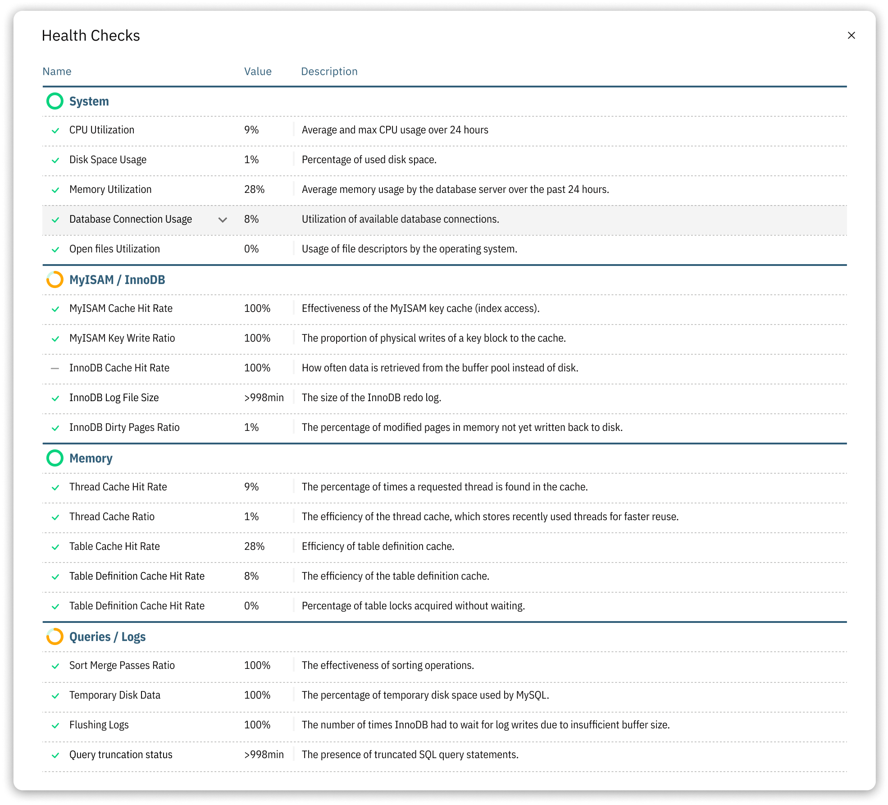

# Health Checks

Use Health Checks to review the database system, storage-engine, memory, query, and log metrics that Releem evaluates. Review a check together with its current value and recent workload before deciding whether further investigation or a configuration change is needed.

Releem groups these metrics into four blocks: System, Engine, Memory, and Queries/Logs. A check is a diagnostic signal; it does not by itself identify the cause of a problem or guarantee a performance outcome.

## System Block
The System block shows essential system-level metrics for reviewing the overall state of your server.

- **CPU Utilization**: Measures the percentage of CPU capacity being used.
- **Memory Utilization**: Monitors the percentage of memory usage on the server.
- **Disk Space Usage**: Tracks the amount of disk space being used and helps identify potential storage issues.
- **Database Connection Utilization**: Monitors the percentage of connections used out of the total available connections.

## MyISAM/InnoDB Block (for MySQL and MariaDB)
The MyISAM/InnoDB block focuses on specific storage engines and their related metrics.

- **MyISAM Cache Hit Rate**: Measures the efficiency of the MyISAM key cache.
- **MyISAM Key Write Ratio**: Monitors the ratio of key writes to key write requests for MyISAM tables.
- **InnoDB Cache Hit Rate**: Assesses the effectiveness of the InnoDB buffer pool.
- **InnoDB Log File Size**: Monitors the size of the InnoDB log files as an input to performance review.

## Memory Block
The Memory block checks metrics related to memory usage and allocation.

- **Thread Cache Hit Rate**: Evaluates the effectiveness of the thread cache.
- **Thread Cache Ratio**: Monitors the ratio of threads created to connections.
- **Table Cache Hit Rate**: Measures the efficiency of the table cache.

## Queries/Logs Block
The Queries/Logs block examines metrics associated with queries and logs.

- **Sort Merge Passes Ratio**: Measures the ratio of merge passes to sorts performed.
- **Temporary Disk Data**: Monitors the amount of temporary data written to disk during query execution.
- **QCache Fragmentation**: Tracks the fragmentation level of the query cache.
- **Flushing Logs**: Tracks the frequency of log flushing, which can impact server performance.

Use these metrics to decide where to investigate further. Review a check with other server and workload evidence before acting on a Releem recommendation. A Health Check does not by itself prove the cause of a problem or guarantee that a change will improve performance.
