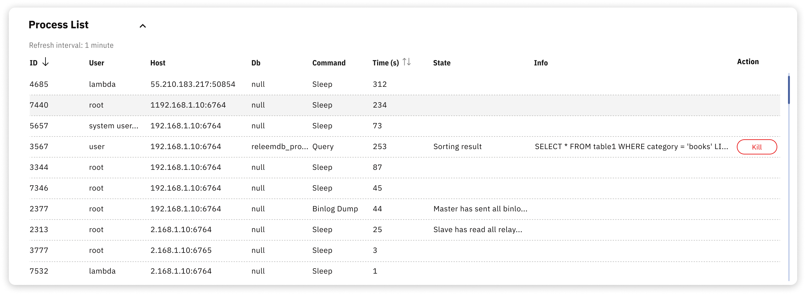

# Process List

Use Process List to inspect active databasw connections and running queries reported for the selected server. This centralized Dashboard view lets you investigate database activity without opening an SSH session just to view the process list.

The Process List can help you investigate:

- **Identify long-running queries** – Find queries that consume excessive time or resources, then review their workload context
- **Detect stuck processes** – Review connections that may be stuck before deciding whether termination is appropriate
- **Troubleshoot bottlenecks** – Inspect table locks and query contention as evidence of a possible bottleneck
- **Track connection activity** – Observe which applications and users are connected

The Process List shows activity to investigate; it does not by itself prove the cause of a database problem or determine whether a connection should be terminated. Confirm the workload context and application impact before you terminate a connection or change the database.