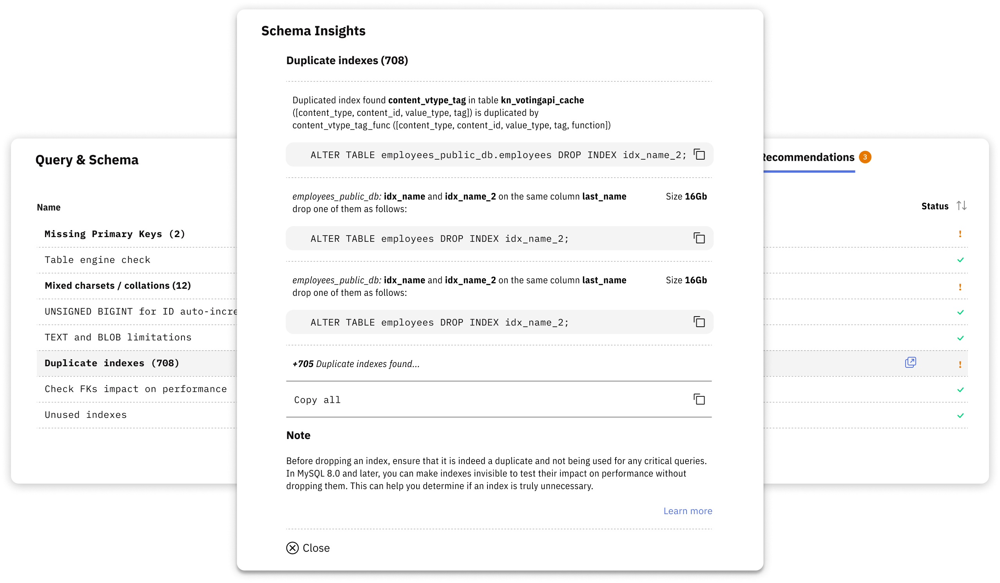

# Schema Optimization

Use Schema Optimization to review schema issues that Releem detected and any SQL proposed for addressing them. These issues may affect performance, storage efficiency, or data integrity.

A detected issue describes the database structure that Releem observed. The provided SQL is a proposed change, not an applied change. Review the affected objects and test the proposed SQL before you decide whether to execute it.

Schema Optimization reports these issue types:

- **Missing Primary Keys** – May cause replication issues and performance degradation
- **Duplicate & Unused Indexes** – May waste disk space and slow down write operations
- **Deprecated Storage Engines** – Tables using MyISAM instead of InnoDB
- **Mixed Character Sets & Collations** – May prevent index usage and slow queries
- **Table Fragmentation** – Scattered data may reduce query efficiency
- **Auto Increment Overflow Risks** – Insufficient column types for growing tables

## Review and apply a schema change

1. **Open Schema Optimization.** Navigate to the **Schema Optimization** section in your Releem dashboard.
2. **Review the detected issue.** Review detected issues categorized by type and severity.
3. **Review the proposed SQL.** Copy the provided SQL statements (e.g., `ALTER TABLE`).
4. **Test the proposed SQL.** Test changes in a development environment first.
5. **Execute the approved SQL.** Execute the SQL on your production database during low-traffic periods.

To let Releem apply approved schema changes for you instead of running SQL manually, follow [Automatic Schema Changes](/recommendations/query-optimization/automatic-schema-changes).

If an automatic schema change fails in Releem, use the [Schema Change Troubleshooting](/recommendations/query-optimization/schema-change-troubleshooting) guide to match the error to the next action.

For detailed information about each type of schema check and comprehensive best practices, see the [MySQL Database Schema Checks](https://releem.com/blog/mysql-database-schema-checks) article.

Use the detected issue, affected objects, and your test results to decide whether the proposed change is appropriate for your database.
