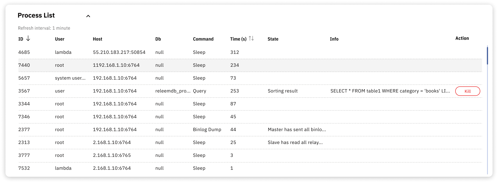

# Process List

Releem's Process List offers real-time visibility into all active MySQL connections and running queries. This centralized interface removes the need for manual SSH access, enabling you to monitor database activity and troubleshoot issues directly from your dashboard.

The process list helps to resolve the following issues:
- **Identify long-running queries** – Discover queries that consume excessive time and resources
- **Detect stuck processes** – Identify problematic connections that require termination
- **Troubleshoot bottlenecks** – Analyze table locks and query contention
- **Track connection activity** – Observe which applications and users are connected

For detailed information, refer to the [Show MySQL Process List](https://releem.com/blog/show-mysql-process-list) article.
