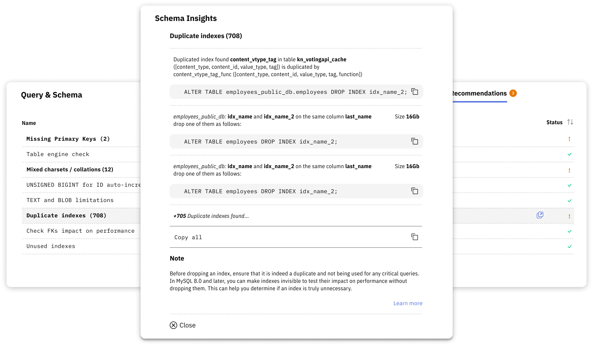

# Schema Optimization

Releem's Schema Optimization feature automatically examines your database structure to identify schema issues that can impact performance, storage efficiency, and data integrity. It is like the schema watchdog that  detects problems before they become serious and provides ready-to-use SQL recommendations.

Schema optimization helps you detect and fix:

- **Missing Primary Keys** – Causes replication issues and performance degradation
- **Duplicate & Unused Indexes** – Waste disk space and slow down write operations
- **Deprecated Storage Engines** – Tables using MyISAM instead of InnoDB
- **Mixed Character Sets & Collations** – Prevent index usage and slow queries
- **Table Fragmentation** – Scattered data reduces query efficiency
- **Auto Increment Overflow Risks** – Insufficient column types for growing tables

### Using Schema Optimization

1. Navigate to the **Schema Optimization** section in your Releem dashboard
2. Review detected issues categorized by type and severity
3. Copy the provided SQL statements (e.g., `ALTER TABLE`)
4. Test changes in a development environment first
5. Execute the SQL on your production database during low-traffic periods

For detailed information about each type of schema check and comprehensive best practices, see the [MySQL Database Schema Checks](https://releem.com/blog/mysql-database-schema-checks) article.

Schema optimization is essential for maintaining long-term database health and performance as your application grows.
