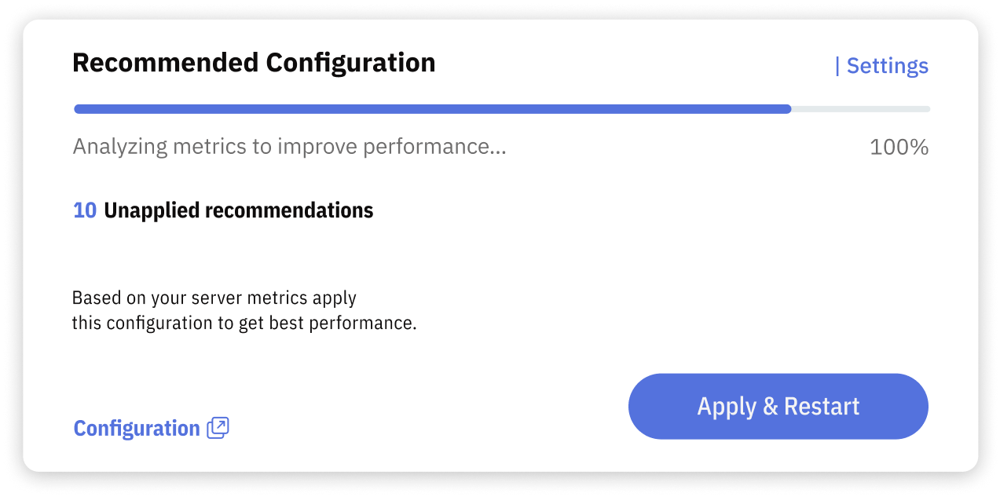

# Getting and Applying Recommendations

The Recommended Configuration block displays the current state of the configuration tuning process as it works to identify performance improvements for your MySQL server. This block provides valuable insights into the optimization process, allowing you to monitor progress and take action as needed.

The Recommended Configuration block consists of several components:

- **Progress Bar**: The progress bar shows the process state, which can be either: "Searching Opportunities" or "Preparing Configuration". The Releem platform uses AI to continuously search for opportunities to enhance MySQL performance. If Releem identifies a viable hypothesis, the expert system checks whether it can be safely applied. Once all checks are complete, Releem prepares the recommended configuration.
- **Unapplied Recommendations Count**: Displays the number of recommendations that have not yet been applied to your server.
- **Recommended Configuration Link**: Click this link to view the complete recommended configuration suggested by Releem.
- **Apply button**: Click it and follow the instructions to implement the recommended configuration on your server.

Releem automates the process of applying and rolling back recommended configurations for self-managed instances where the Releem Agent is installed without Docker. Learn more about how to use these features:

- [How to Apply](/configuration-tuning/how-to-apply-configuration-using-portal): A guide on applying the recommended configuration to your server.
- [How to Rollback](/configuration-tuning/how-to-rollback-to-previous-configuration): A guide on rolling back the recommended configuration if needed.

Utilizing the Recommended Configuration block lets you stay informed about the optimization process and easily apply configurations as needed to maintain optimal MySQL performance.

## Frequently Asked Questions about Configuration Tuning

### How long does it take to receive my first recommended configuration?
You'll receive your first set of recommended configurations within 24 hours of adding your server to Releem.

### How often will I receive new recommended configurations?
Releem continuously searches for opportunities to improve your MySQL performance. Whenever our system identifies a viable hypothesis, we'll generate a new set of recommendations and notify you. The frequency of new recommendations depends on your server's unique performance patterns and workload.

### How do I know if the recommended configuration is applied?
You can check the status the Recommended Configuration block. If the configuration is applied, the status will be "All recomendations have been applied".

