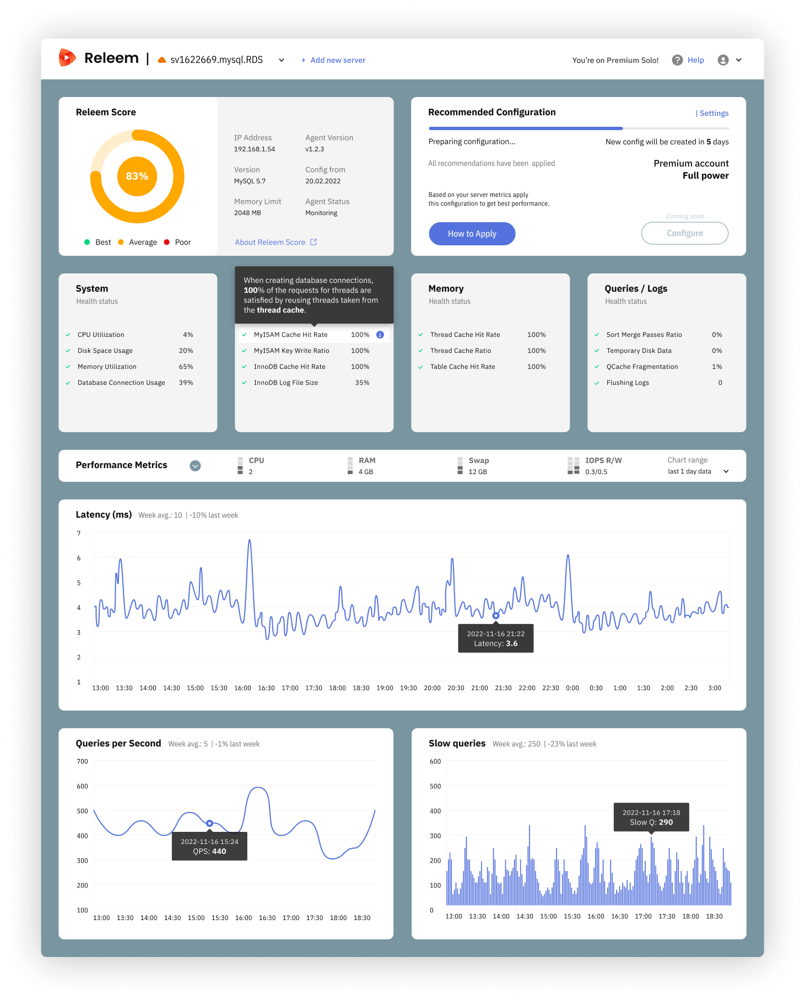

# Dashboard

The Releem Dashboard provides a comprehensive view of your server's performance, making it easy to monitor and optimize your MySQL instance. By regularly reviewing the dashboard, you can proactively address potential issues and maintain peak performance for your database.

The Releem Dashboard offers insights and recommendations for monitoring and improving MySQL performance. The dashboard consists of several blocks, each focusing on a specific aspect of your server's health and performance.

## 1. Releem Score
The Releem Score block displays the server's status and Releem Score, representing the best practices (health checks) for maintaining servers. The score provides a quick overview of your server's health, allowing you to assess its performance at a glance.

## 2. [Recommended Configuration](/getting-started/step-3-getting-and-applying-recommendations)
The Recommended Configuration block comes into play when Releem identifies opportunities to improve performance. Releem assesses the necessary configuration changes and notifies you when they're ready to apply. This block provides a concise summary of Releem's recommendations, making it easy to implement changes to enhance your MySQL performance. The Releem MySQL tuning process is designed to optimize MySQL performance using a systematic approach.

## 3. [Health Checks](/getting-started/step-5-health-checks)
MySQL Health Checks are diagnostic tests that evaluate a server's health, performance, and stability. Regular MySQL Health Checks are essential for ensuring optimal server operation and meeting business requirements. Releem performs health checks twice a day, providing users with up-to-date insights into their database's current state.

## 4. Performance Monitoring
The Performance Metrics block displays key instance metrics, such as CPU usage, Memory Usage, Swap usage, and IOPS. Monitoring these metrics helps you keep a close eye on your server's performance. Clicking on a metric displays a daily graph, offering a visual representation of the metric's performance over time. 

The MySQL Metrics consists of several charts, including:
- Latency: This graph shows the P95 MySQL Latency, indicating the query execution time.
- QPS (Queries Per Second): A measure of the number of queries processed per second.
- Slow Log Queries: This graph displays the number of slow queries, helping you identify performance bottlenecks.

## 5. [Query & Schema](/getting-started/step-6-query-analytics-optimization)
- Query Analytics tab provides insights into your database's performance by analyzing top and slow queries, including execution statistics, to help identify and resolve bottlenecks.
- Query Optimization tab offers automatic recommendations, such as index suggestions and query enhancements, to improve efficiency and reduce resource usage.
- Schema Checks tab ensures your database structure remains optimized through automated reviews that detect inefficiencies and suggest actionable improvements.
