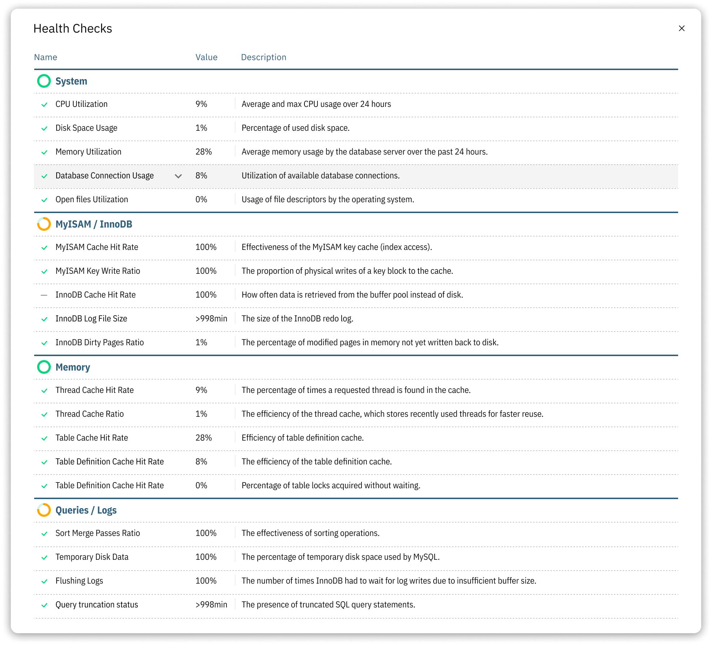

# Health Checks

MySQL Health Checks are diagnostic tests that evaluate a server's health, performance, and stability. They play a critical role in maintaining the optimal performance of your MySQL server. Releem regularly calculates and checks a variety of metrics across four main blocks: System, MyISAM/InnoDB, Memory, and Queries/Logs.

## System Block
The System block monitors essential system-level metrics to ensure the overall health of your server.

- **CPU Utilization**: Measures the percentage of CPU capacity being used.
- **Memory Utilization**: Monitors the percentage of memory usage on the server.
- **Disk Space Usage**: Tracks the amount of disk space being used and helps identify potential storage issues.
- **Database Connection Utilization**: Monitors the percentage of connections used out of the total available connections.

## MyISAM/InnoDB Block
The MyISAM/InnoDB block focuses on specific storage engines and their related metrics.

- **MyISAM Cache Hit Rate**: Measures the efficiency of the MyISAM key cache.
- **MyISAM Key Write Ratio**: Monitors the ratio of key writes to key write requests for MyISAM tables.
- **InnoDB Cache Hit Rate**: Assesses the effectiveness of the InnoDB buffer pool.
- **InnoDB Log File Size**: Monitors the size of the InnoDB log files to ensure optimal performance.

## Memory Block
The Memory block checks metrics related to memory usage and allocation.

- **Thread Cache Hit Rate**: Evaluates the effectiveness of the thread cache.
- **Thread Cache Ratio**: Monitors the ratio of threads created to connections.
- **Table Cache Hit Rate**: Measures the efficiency of the table cache.

## Queries/Logs Block
The Queries/Logs block examines metrics associated with queries and logs.

- **Sort Merge Passes Ratio**: Measures the ratio of merge passes to sorts performed.
- **Temporary Disk Data**: Monitors the amount of temporary data written to disk during query execution.
- **QCache Fragmentation**: Tracks the fragmentation level of the query cache.
- **Flushing Logs**: Tracks the frequency of log flushing, which can impact server performance.

By regularly performing MySQL Health Checks and monitoring these metrics, you can proactively address potential issues and maintain peak performance for your database. Releem makes it easy to keep an eye on these crucial metrics and helps you optimize your MySQL server based on its expert recommendations.