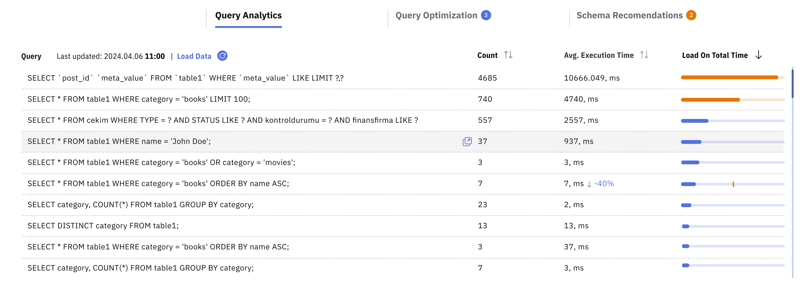
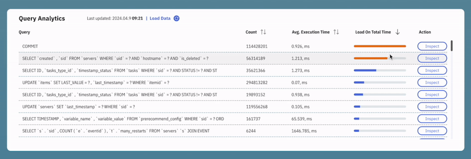
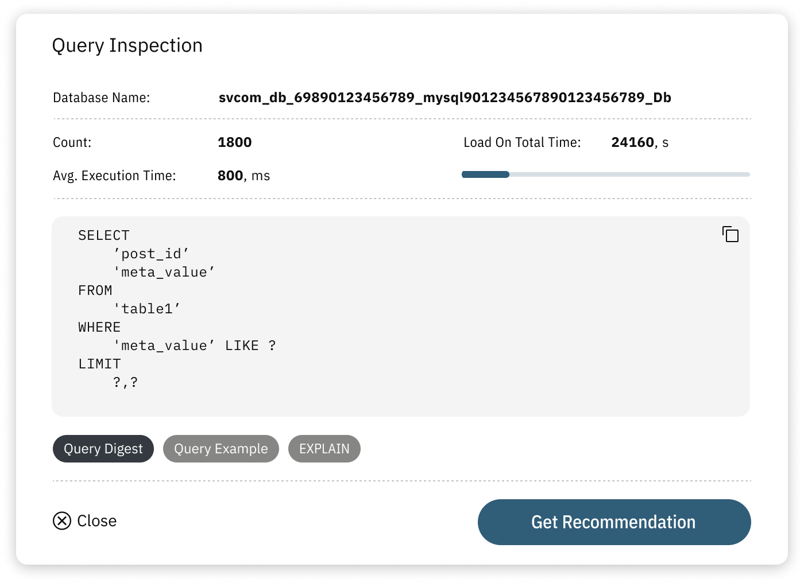

# Query Analytics & Optimization

Releem's Query Analytics offers detailed insights into MySQL query performance, helping you identify slow and inefficient queries. Whether you are troubleshooting slow queries or fine-tuning for better performance, Releem's Query Analytics is an essential tool for maintaining and enhancing your database's efficiency.

The block includes the following columns:

- **Count** – A running count of how many times the query has executed since the last server restart.
- **Average Execution Time** – Shows you the time it takes for each query to execute, allowing you to quickly identify and address slow-performing queries that can hinder your database performance.
- **Load on Total Time** – Evaluates the total time consumed by all instances of that query, giving you a clear understanding of the query's cumulative impact on your server. This column includes a helpful visual (orange or blue bar) so you can quickly gauge which queries are having a greater impact.
- **Action** – Click on the query or Inspect button to view a specific query in detail.

### How to Show Slow Queries – Sort by Average Time
To view slow queries, find the Query Analytics Block on the dashboard. Click the 'Avg. Execution Time' column heading. This will sort your top 100 queries in order, with the slowest-executing queries listed at the top.

### How to Show Queries With Highest Performance Impact – Sort by Total Load Time
To view queries that have the greatest impact on your server's performance, find the Query Analytics Block on the dashboard. Click the 'Load on Total Time' column heading. This will sort your top 100 queries in order, with the queries that are using the most resources overall listed at the top.

### How to Inspect Query Details and Optimize SQL Queries

Click on the query in the Query Analytics tab to view the full query statement. Click the Get Recommendations button to get suggestions on query performance optimization and missed indexes.
