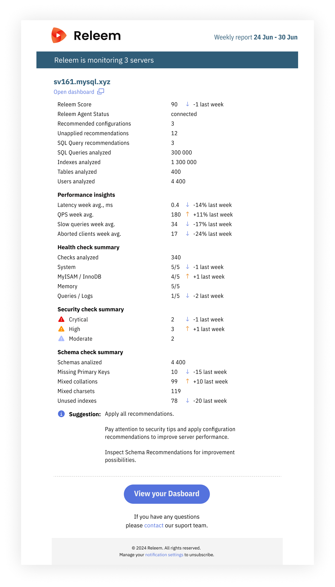

# Weekly Reports

Releem Weekly Reports are designed to provide you with a concise yet comprehensive overview of your servers' performance and status. These reports keep you informed about essential information, saving you time and helping you make informed decisions. The updated report includes data on all servers, unapplied recommendations, the status of the Releem Agent, and performance insights such as Latency and QPS improvements.

## Overview of Weekly Report Contents

1. **All Servers**  
   The report includes a summary of all servers being monitored by Releem, providing an at-a-glance view of their performance and health. This information helps you quickly assess the overall state of your MySQL instances.

2. **Unapplied Recommendations**  
   The weekly report lists any unapplied recommendations generated by Releem. These recommendations represent opportunities for performance improvement, and applying them can help you maintain an optimally performing MySQL server.

3. **Releem Agent Status**  
   The report provides an update on the status of the Releem Agent installed on your servers. This information is crucial to ensure the agent functions correctly and provides accurate data to the Releem platform.

4. **Performance Insights**  
   Releem Weekly Reports include performance insights, such as Latency and QPS improvements. These insights help you gauge the effectiveness of applied recommendations and track the progress of your server's performance over time.

## Benefits of Releem Weekly Reports

By providing a comprehensive view of your servers' performance and status, Releem Weekly Reports offer several key benefits:

- **Time Savings**: The report consolidates essential information, allowing you to quickly review the state of your servers without having to manually compile data.
- **Informed Decision Making**: The insights and recommendations provided in the report empower you to make data-driven decisions to optimize your MySQL server's performance.
- **Performance Tracking**: Regularly reviewing the weekly report helps you monitor performance trends and identify areas for improvement.

Releem Weekly Reports are a valuable resource for maintaining and enhancing the performance of your MySQL servers. By staying informed and proactively addressing potential issues, you can ensure your database operates optimally and meets your business requirements.
