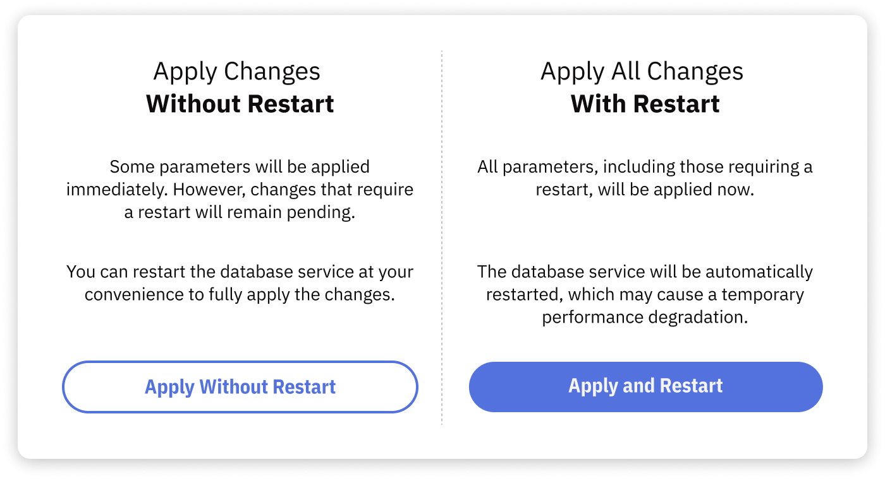

# Apply configuration using the Portal

Use the Releem Portal to review and submit a recommended configuration. This page describes the shared Portal sequence for self-managed MySQL and MariaDB, and the shared interface shown for managed MySQL on AWS RDS, GCP Cloud SQL, and Azure Database for MySQL.

For a managed MySQL deployment, use **Apply** only after Releem Support confirms that Portal application is available for that deployment and the provider administrator separately approves narrowly scoped configuration-changing authority. Otherwise, do not apply the change. Portal application is not documented for PostgreSQL.

## Before you begin

1. Confirm that you selected the intended server.
2. Review every changed value and record the current values before you apply the recommendation.
3. For a self-managed server, create a known-good backup artifact of the active database configuration and confirm the approved service restart procedure.
4. For a managed server, record the assigned parameter group or database flags and every previous value. Confirm an applicable provider recovery procedure. If no verified recovery procedure exists, do not proceed; contact Releem Support.
5. Plan the maintenance window and application checks.
6. Confirm the required access in [MySQL Required Permissions](/supported-databases/mysql/required-permissions) or [MariaDB Required Permissions](/supported-databases/mariadb/required-permissions).
7. For managed MySQL, obtain Releem Support confirmation for the exact deployment and separate provider-administrator approval for narrowly scoped configuration-changing authority. Installation access alone is not sufficient. Otherwise, do not apply.

## Apply the configuration

1. Open the server in the Releem Dashboard.
2. Open **Configuration** in the **Recommended Configuration** block.
3. Review the proposed changes and their current values.
4. Select **Apply**, then choose the option available for the server:
   - **Apply Without Restart** submits values that the database or provider can apply dynamically. Confirm that those values are active; restart-required values can remain pending.
   - **Apply and Restart** submits the changes and requests a database service or managed-instance restart. Use it only during an approved maintenance window.
5. Wait for the application task to finish, then verify the result below.

## Verify the result

1. Check whether any value remains restart-pending or requires a restart.
2. Verify the effective database settings on the database server or managed instance.
3. Confirm the database service or instance health is normal and its status is available or running.
4. Check application connectivity and review application errors.
5. Confirm the Releem event for the application attempt, then review current metrics for the same server.

The Portal task completing or an event appearing does not prove that every value is effective.

## Troubleshooting self-managed servers

### The recommendation is only partially applied

Check for restart-required variables. If a restart is pending, use **Apply and Restart** only in an approved maintenance window, then repeat the effective-value and health checks.

### The Releem database user lacks access

Do not add grants from a generic troubleshooting command. Compare the account with the canonical [MySQL permissions](/supported-databases/mysql/required-permissions) or [MariaDB permissions](/supported-databases/mariadb/required-permissions), and have the database owner approve any change.

### Recommended Configuration is not available

Confirm that the Agent is connected and current database metrics are arriving. Review [Releem Agent logs](/installation/manage-the-releem-agent/logs) if collection is not current. Do not submit an older proposal to work around a missing result.

### The configuration directory or restart command cannot be found

Confirm that the Agent was installed on the database host and that its configured database path and service controls match the active installation. Use the matching [installation guide](/installation) and [Agent configuration reference](/installation/manage-the-releem-agent/configuration). Do not reinstall until you have identified why the active path or service differs.

### The database service does not restart

Do not retry while the database is unhealthy. Check the database error log and service status. Restore the known-good configuration artifact to the active path, then restart the database through your approved service procedure. If you cannot restore service, contact Releem Support and your database owner.

### The application task or Agent stops unexpectedly

Review the [Releem Agent logs](/installation/manage-the-releem-agent/logs) for the failed task. Remove credentials and customer data before sharing a focused excerpt with Releem Support.

## Troubleshooting managed MySQL

### AWS RDS

Confirm that the DB instance is available, the assigned parameter group is the intended group, and its status is in sync. Check whether values are pending reboot. Review the access and parameter-group setup in [Install Releem for MySQL on AWS RDS](/installation/mysql/aws-rds) rather than adding an IAM action from this page. Do not use **Apply** unless Releem Support confirms it for this RDS deployment and the AWS administrator separately approves the required configuration-changing authority.

### GCP Cloud SQL

Confirm that the MySQL instance is available, the expected database flags were submitted, and the Agent identity has the access documented in [Install Releem for MySQL on GCP Cloud SQL](/installation/mysql/gcp-cloud-sql). Check for a pending restart before verifying effective values. Do not use **Apply** unless Releem Support confirms it for this Cloud SQL deployment and the Google Cloud administrator separately approves the required configuration-changing authority.

### Azure Database for MySQL

Confirm that the Flexible Server state is **Ready** and that the Agent identity has the access documented in [Install Releem for MySQL on Azure Database for MySQL](/installation/mysql/azure-database-for-mysql). If the Portal shows a partial application, check for restart-required values before choosing **Apply and Restart**. Do not use **Apply** unless Releem Support confirms it for this Azure deployment and the Azure administrator separately approves the required configuration-changing authority.

If a managed-instance change fails, do not retry while the instance is unhealthy. Restore the recorded parameter group or flag values through the applicable provider recovery procedure. If no verified recovery procedure exists, do not proceed; contact Releem Support and the provider administrator. Do not broaden an identity role from this troubleshooting page.
