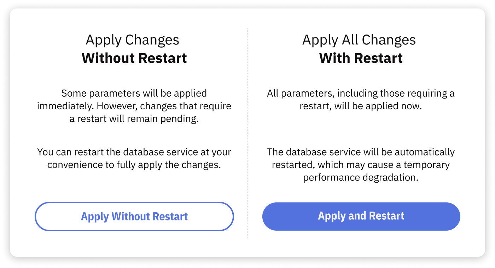

# Apply configuration using the Portal

Use the Releem Portal to review and submit a recommended configuration. This page describes the shared Portal sequence for self-managed MySQL and MariaDB, and the shared interface shown for managed MySQL on AWS RDS, GCP Cloud SQL, and Azure Database for MySQL.

For a managed MySQL deployment, use **Apply** only after Releem Support confirms that Portal application is available for that deployment and the provider administrator approves the exact changes and their scope. Otherwise, do not apply the change. Portal application is not documented for PostgreSQL.

## Apply the configuration

1. Open the server in the Releem Dashboard.
2. Open **Configuration** in the **Recommended Configuration** block.
3. Review the proposed changes and their current values.
4. Select **Apply**, then choose the option available for the server:
   - **Apply Without Restart** submits values that the database or provider can apply dynamically. Confirm that those values are active; restart-required values can remain pending.
   - **Apply and Restart** submits the changes and requests a database service or managed-instance restart. Use it only during an approved maintenance window.
5. Wait for the application task to finish, then verify the result below.

## Troubleshooting self-managed servers

Use the heading that matches the message shown in Releem. Preserve the exact message when you collect Agent or database logs.

### `The latest recommended configuration is partially applied`

Check for restart-required variables. If a restart is pending, use **Apply and Restart** only in an approved maintenance window, then repeat the effective-value and health checks.

### `MySQL 'releem' user lacks required permissions to apply without restarting`

Do not add grants from a generic troubleshooting command. Compare the account with the canonical [MySQL permissions](/supported-databases/mysql/required-permissions) or [MariaDB permissions](/supported-databases/mariadb/required-permissions), and have the database owner approve any change.

### `Recommended MySQL Configuration Not Found`

Confirm that the Agent is connected and current database metrics are arriving. Review [Releem Agent logs](/installation/manage-the-releem-agent/logs) if collection is not current. Do not submit an older proposal to work around a missing result.

### `MySQL Version Lower Than 5.6.7`

Do not use a generic redo-log replacement procedure. Review the recommendation and use the [manual MySQL application guide](/recommendations/configuration-tuning/apply-manually/mysql?platform=linux) with a version-specific maintenance and recovery plan.

### `MySQL Configuration Directory Not Found`

Confirm that `mysql_cnf_dir` in the [Agent configuration](/installation/manage-the-releem-agent/configuration) points to the active database include directory. Confirm that the directory exists and is writable by the supported application workflow. Do not reinstall the Agent until you have identified why the path is missing or incorrect.

### `Command to Restart MySQL Service Not Found`

Confirm that `mysql_restart_service` in the [Agent configuration](/installation/manage-the-releem-agent/configuration) matches the service command used on this host. For a database in Docker, use the documented container restart workflow rather than a host service command.

### `No Confirmation to Restart Service Received`

Check the database service state and database error log. A large database can take longer to restart, but do not assume that a delayed response is successful. Confirm service health and application connectivity before retrying.

### `MySQL Service Failed to Start in 1200 Seconds`

The Agent did not observe a successful database start before its timeout. Check the service state and database error log. If the service is still starting, continue to monitor it without submitting another configuration task. If startup failed, restore the known-good configuration.

### `MySQL Service Failed to Start`

Do not retry while the database is unhealthy. Check the database error log and service status. Restore the known-good configuration artifact to the active path, then restart the database through your approved service procedure.

### `Failed to finish applying the configuration`

The Agent stopped or could not report the final task state. Review the [Releem Agent logs](/installation/manage-the-releem-agent/logs), the database error log, and the effective database settings. Remove credentials and customer data before sharing a focused log excerpt with Releem Support.

### `Unexpected Releem Agent error`

Confirm that `/opt/releem/mysqlconfigurer.sh` exists and is executable by the account used for the application task. Review the [Releem Agent logs](/installation/manage-the-releem-agent/logs) for the first error. Do not replace the script or reinstall the Agent until the failure is understood.

### `The DB configuration file does not include the directory that contains Releem's option files`

Confirm that the active database configuration includes the directory configured by `mysql_cnf_dir`. For Docker, confirm that the generated-configuration directory is mounted into the database container and included by its active configuration. Use the matching [installation guide](/installation) before retrying.

## Troubleshooting AWS RDS

### `RDS database instance has a status of not available`

Open the RDS console and inspect the instance status and recent events. Correct the provider-reported problem or wait for the instance to return to **Available** before retrying. Do not submit another configuration task while the instance is unhealthy.

### `DB instance parameter group has a status of not in-sync`

Open the instance's **Configuration** tab and inspect the assigned parameter group. Resolve pending or failed changes and complete any required reboot. Retry only after the parameter group reports **In sync** and the instance is **Available**.

### `DB instance parameter group is not specified in the Agent settings, or is not found in the database configuration`

Confirm that the intended parameter group is assigned to the RDS instance. Then confirm that `aws_rds_parameter_group` in the [Agent configuration](/installation/manage-the-releem-agent/configuration) or the CloudFormation **DBParameterGroup** value uses that exact name. Update the CloudFormation stack or Agent setting through the installation method you use.

### `Parameter group applying failed by timeout (long applying)`

Check the RDS instance, parameter-group status, and recent RDS events. A provider operation can continue after the Portal task times out. Do not submit the same change again until the current provider operation finishes or fails.

### `RDS database instance failed to apply configuration`

Review the RDS event and the parameter that failed. Confirm that the value is accepted by the selected engine version and parameter-group family. Restore the recorded value or previous parameter group when the instance does not return to its expected state.

### `Other errors applying without restart`

Check the effective parameter values, parameter-group status, RDS events, and [Agent logs](/installation/manage-the-releem-agent/logs). A completed Portal task does not prove that the provider accepted every value.

### `IAM role lacks required permissions to apply`

Compare the Agent identity with the monitoring and configuration-access separation documented for [MySQL on AWS RDS](/installation/mysql/aws-rds) or [MariaDB on AWS RDS](/installation/mariadb/aws-rds). Add `rds:ModifyDBParameterGroup` only when configuration application is approved for this Agent and parameter group; do not broaden the monitoring role with unrelated actions.

### `The latest recommended configuration is partially applied. To fully apply all parameters, restart the database instance.`

Some parameters remain pending until RDS reboots the instance. Review the pending values, plan the interruption, and choose **Apply and Restart** only during the approved maintenance window. After the instance returns to **Available**, verify the effective values and application connectivity.

## Troubleshooting GCP Cloud SQL

### `Compute Engine VM instance lacks required permissions to apply`

Confirm that the Agent's Google Cloud identity has the Cloud SQL and Cloud Monitoring access documented in [Install Releem for MySQL on GCP Cloud SQL](/installation/mysql/gcp-cloud-sql). Keep monitoring access separate from configuration-changing access and add only the approved actions required by the application workflow.

### `Other errors applying without restart`

Review the [Agent logs](/installation/manage-the-releem-agent/logs), Cloud SQL operation history, submitted database flags, and effective settings. Check whether Cloud SQL requires a restart. Do not repeat the task while an earlier provider operation is still running.

## Troubleshooting Azure Database for MySQL

### `Azure identity lacks permissions to read the server`

Confirm that the Agent identity can read the intended Flexible Server and its monitoring data. Review the identity and scope documented in [Install Releem for MySQL on Azure Database for MySQL](/installation/mysql/azure-database-for-mysql), then restart the Agent after correcting access.

### `Azure identity lacks permissions to apply configuration`

Do not grant a broad subscription or resource-group role from this troubleshooting page. Have the Azure administrator approve a role scoped to the intended server and required configuration actions, then retry only after the effective assignment is visible.

### `The latest recommended configuration is partially applied`

Check for parameters that require a restart. Review the pending values and use **Apply and Restart** only during an approved maintenance window. Confirm effective settings after the Flexible Server returns to **Ready**.

### `Azure MySQL server is not Ready`

Review the Flexible Server status and recent Azure operations. Wait for the server to return to **Ready**, then confirm application connectivity before retrying the configuration task.

If a managed-instance change fails, do not retry while the instance is unhealthy. Restore the recorded parameter group or flag values through the applicable provider recovery procedure. If no verified recovery procedure exists, contact Releem Support and the provider administrator.
