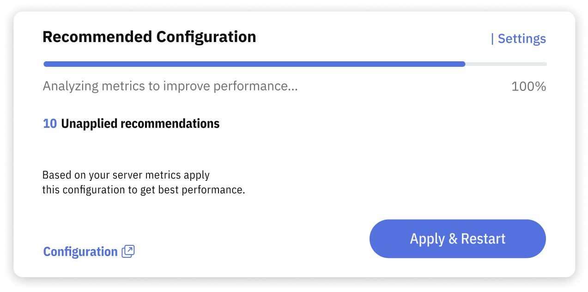

# Recommendations

Use Recommendations to review actions that Releem proposes from observed database data. A Dashboard check or metric describes current state; a recommendation presents a proposed action. Review the evidence, affected scope, application method, and rollback guidance before you make a production change.

Start with Configuration Tuning for server configuration or Query Optimization for query and index proposals. Return to the [Dashboard](/dashboard) when you need to inspect the observations behind a recommendation.

## Query Optimization

Query Optimization analyzes production query execution data and recommends changes for queries with a high performance impact. It supports two workflows:

- **Weekly analysis:** Releem reviews the 100 most frequent queries and the 100 slowest queries.
- **On-demand analysis:** You select a query in Query Analytics and request a recommendation.

Releem considers execution statistics, access patterns, and existing indexes. A recommendation can address query logic, indexes, schema, or a related server configuration constraint. Releem presents the proposed change for review; it does not apply the change automatically.

After you apply a recommendation manually, Releem continues observing the query so you can compare its execution time, frequency, and overall impact. See [Query Optimization](/recommendations/query-optimization) for the complete workflow.

## Recommended Configuration

The **Recommended Configuration** block shows the current Configuration Tuning state for your MySQL server. It lets you open the proposed settings and see whether a recommendation still needs review or application.

The block includes:

- **Progress bar:** Shows **Searching Opportunities** or **Preparing Configuration** while Releem evaluates observed data and prepares a proposal.
- **Unapplied recommendations count:** Shows how many proposed configuration changes have not been applied.
- **Recommended Configuration:** Opens the complete proposed configuration.
- **Apply:** Opens the application options available for this server and environment.

Read [Configuration Tuning](/recommendations/configuration-tuning/mysql-tuning-process) to understand the workflow. When a recommendation is ready, [choose how to apply it](/recommendations/configuration-tuning/apply-configuration). Some settings require a database restart before they become effective. Confirm the effective settings, database and application health, and current metrics after any application attempt. If you need to restore a previous configuration, review the documented [Rollback](/recommendations/configuration-tuning/rollback) method and its limitations first.

The time needed to prepare a recommendation depends on the data available for the server. The block state tells you whether Releem is still evaluating data or has prepared a configuration; it does not by itself confirm that submitted settings are active.
