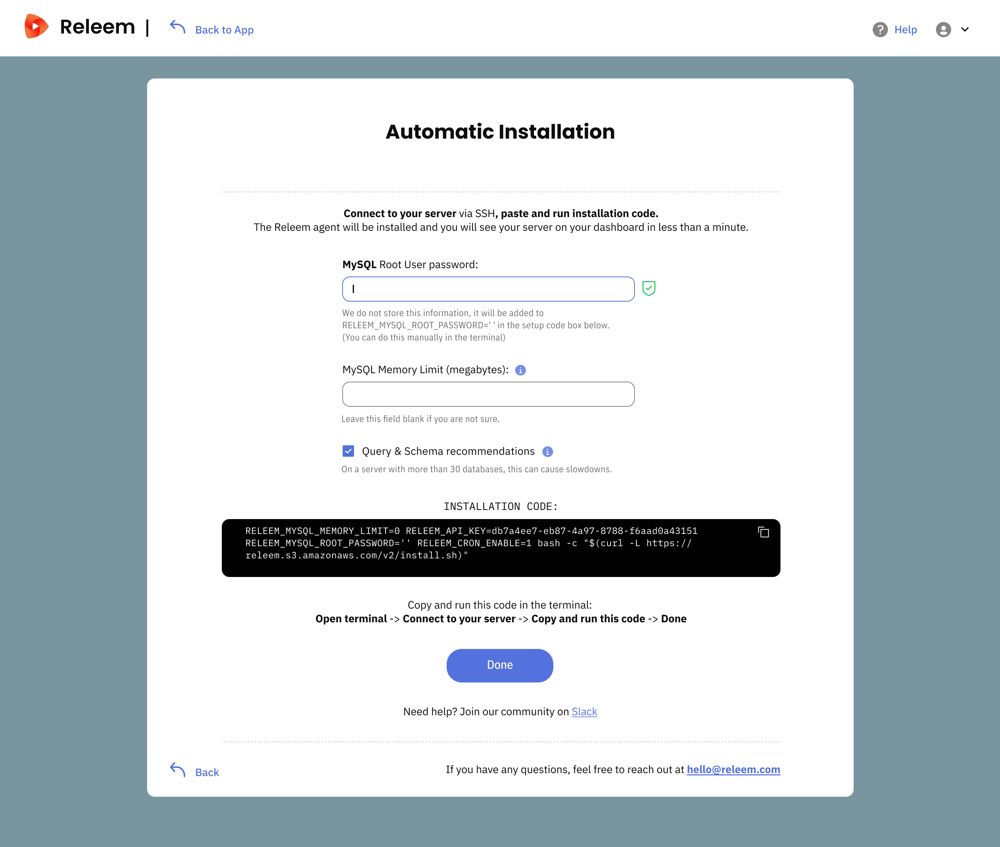

# Automatic Installation for Self-Managed MySQL Servers

Use this instruction to install Releem Agent automatically on every database server. Releem Agent will automatically collect metrics and recommend configuration.

1. Click "Add Server" link at Releem Customer Portal
2. Fill fields:
   - MySQL Root User Password (we don't store this password, it uses only to build Installation command)
   - MySQL Memory Limit in Megabytes. Use this field only if it case there are installed other software on your server.
3. Copy the **Installation command**, paste it into the terminal, and execute as a **root** user.

