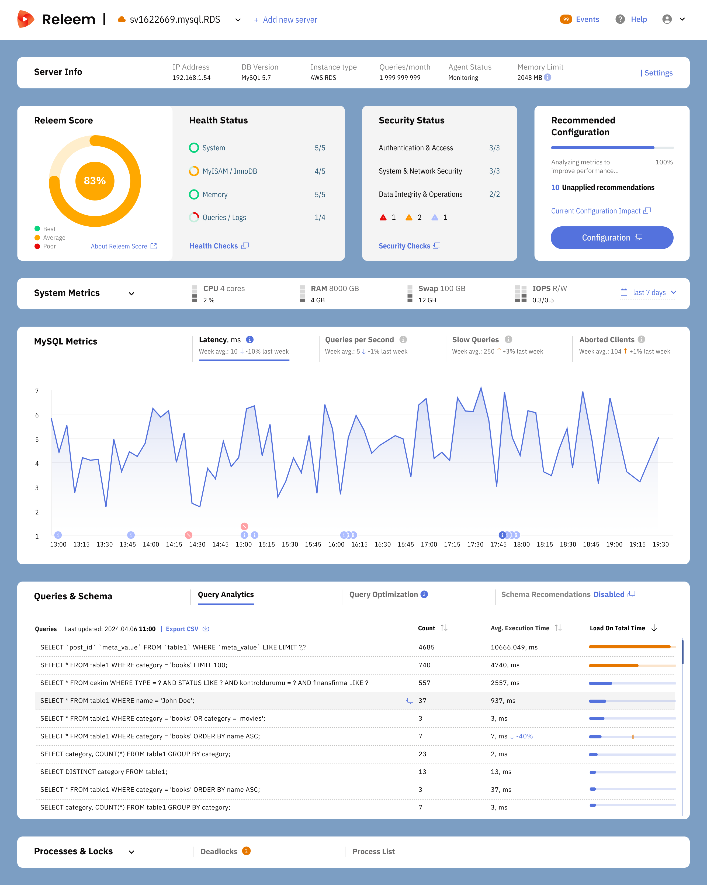

# Welcome to Releem

[Releem](https://releem.com) is an AI-powered MySQL performance monitoring tool that delivers consistent performance through continuous database profiling, configuration tuning, and SQL query optimization. Releem automates analysis, performance issues detection, configuration tuning, query optimization and schema control to save you time and improve MySQL performance. 

This is the Releem documentation. Our documentation is a great place to find most answers and make sure that your experience using Releem is a great one. Please use the search box in the top right or the navigation menu on the left-hand side to explore what Releem can do for you and find the answers you're looking for.

Can't find what you're looking for? Please do contact us for assistance.

Thanks and enjoy Releem!

